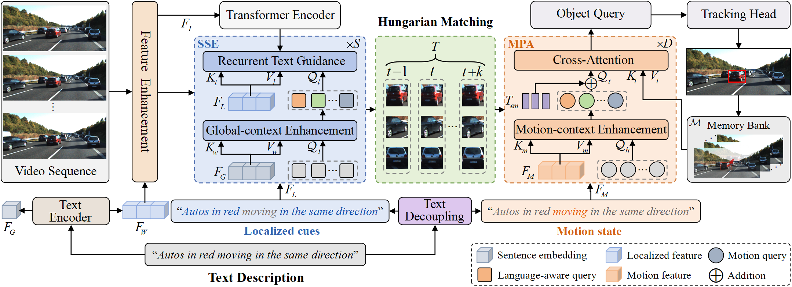

# SGDP-Track: Unified Feature Purification for Referring Multi-Object Tracking

Official implementation for **"Where to Look and What to Trust: Unified Feature Purification for Referring Multi-Object Tracking"**.

SGDP-Track is an end-to-end referring multi-object tracking framework. Given a video and a natural-language query, it detects and tracks all objects matching the expression. The method follows a **Purify-then-Rectify** design:

- **Semantic-Guided Dual-Pruning (SGDP) decoder** filters spatial background tokens with static language prototypes and rectifies unreliable visual channels with an uncertainty gate.
- **Reliability-Aware Contrastive Learning (RACL)** decouples the identity embedding branch from box regression and down-weights noisy contrastive supervision using localization quality.
- **Static/motion language prototypes** are extracted from the referring sentence to separately model appearance cues and motion cues.



## News

- Main training path now enables SGDP prototypes, Top-K spatial pruning, channel rectification, and RACL through `models/transrmot_pro.py`.
- `datasets/` code has been restored so the repository can be imported and trained without relying on ignored local files.
- Training and inference scripts are portable and configurable through environment variables.

## Repository Layout

```text
.
├── main.py                         # distributed training entry
├── inference.py                    # online tracking inference
├── eval.py                         # TrackEval wrapper
├── configs/                        # runnable train/test shell scripts
├── datasets/                       # RMOT/Refer-KITTI dataset loaders
├── models/
│   ├── transrmot_pro.py            # SGDP-Track model and RACL criterion
│   ├── deformable_transformer_plus.py # SGDP decoder implementation
│   ├── spatial_temporal_reason.py  # temporal reasoning module
│   └── ops/                        # MultiScaleDeformableAttention CUDA op
├── util/                           # box, checkpoint, plotting, misc utilities
└── TrackEval/                      # HOTA/DetA/AssA evaluation toolkit
```

## Installation

We recommend Python 3.8, CUDA 11.1, and PyTorch 1.9 for compatibility with the Deformable DETR CUDA operator.

```bash
conda create -n sgdp-track python=3.8 -y
conda activate sgdp-track

pip install torch==1.9.0+cu111 torchvision==0.10.0+cu111 torchaudio==0.9.0 \
  -f https://download.pytorch.org/whl/torch_stable.html
pip install -r requirements.txt

python -m spacy download en_core_web_sm
cd models/ops
sh make.sh
python test.py
```

If your machine is offline, download `roberta-base` in advance and pass it with `--text_encoder_path /path/to/roberta_base --text_encoder_local_files_only`.

## Data Preparation

The loader expects a Refer-KITTI style directory:

```text
Refer-KITTI/
├── images/
├── labels_with_ids/
└── expression/
```

Set the dataset root with `DATA_ROOT` and the split file with `TRAIN_SPLIT`. Example split files are provided in `datasets/data_path/`.

## Training

Refer-KITTI:

```bash
DATA_ROOT=/path/to/Refer-KITTI \
PRETRAIN=/path/to/r50_deformable_detr_plus_iterative_bbox_refinement-checkpoint.pth \
TEXT_ENCODER_PATH=/path/to/roberta_base \
NPROC=4 \
bash configs/dkgtrack_rmot_train_rk.sh
```

Refer-KITTI v2:

```bash
DATA_ROOT=/path/to/refer-kitti-v2 \
TRAIN_SPLIT=/path/to/refer-kitti-v2.train \
PRETRAIN=/path/to/r50_deformable_detr_plus_iterative_bbox_refinement-checkpoint.pth \
TEXT_ENCODER_PATH=/path/to/roberta_base \
bash configs/dkgtrack_rmot_train.sh
```

Important method knobs:

- `--sgdp_topk 300`: keeps the Top-K semantic visual tokens for SGDP spatial pruning.
- `--racl_loss_coef 1`: enables RACL in the total loss.
- `--racl_beta 2`: uses quadratic IoU reliability weighting, matching the paper setting.
- `--racl_temperature 0.07`: InfoNCE temperature.
- `--racl_num_negatives 50`: number of hard negative query embeddings.

## Inference

```bash
DATA_ROOT=/path/to/Refer-KITTI \
CHECKPOINT=/path/to/checkpoint.pth \
TEXT_ENCODER_PATH=/path/to/roberta_base \
bash configs/dkgtrack_rmot_test_rk.sh
```

Outputs are written to `OUTPUT_DIR` and can be evaluated with TrackEval.

## Evaluation

The paper reports HOTA as the primary metric, together with DetA, AssA, DetRe, DetPr, AssRe, AssPr, and LocA.

```bash
python eval.py --gt_dir /path/to/gt --tracker_dir /path/to/predictions
```

Reported results from the paper:

| Dataset | HOTA | DetA | AssA | LocA |
| --- | ---: | ---: | ---: | ---: |
| Refer-KITTI | 53.1 | 40.7 | 69.2 | 90.0 |
| Refer-KITTI v2 | 36.1 | 22.4 | 58.0 | 87.6 |

## Implementation Notes

- SGDP spatial pruning is implemented in `DeformableTransformerDecoderLayer._semantic_topk_prune`.
- SGDP channel rectification uses an uncertainty gate to fuse static and motion prototypes before query normalization.
- RACL is implemented in `ClipMatcher.loss_contrastive`; query embeddings are detached before projection, and the loss is weighted by IoU reliability.
- The text encoder path is configurable through `--text_encoder_path` or the `TEXT_ENCODER_PATH` environment variable.

## Acknowledgements

This repository builds on Deformable DETR, MOTR/TransRMOT-style online tracking, DKGTrack-style language decoupling, and TrackEval.

## Citation

If you use this code, please cite the accompanying paper. A BibTeX entry can be added here after publication.
